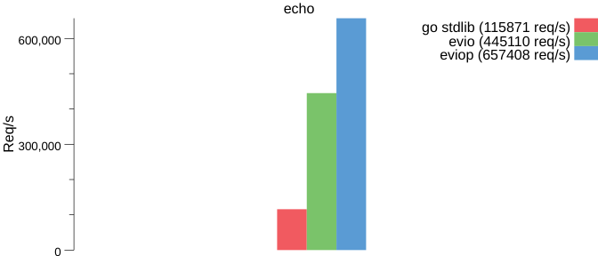
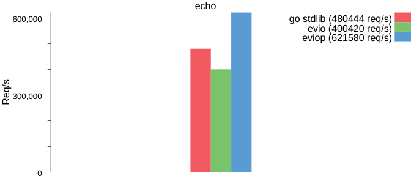

# eviop 

[](https://github.com/Allenxuxu/eviop/actions)
[](https://github.com/Allenxuxu/eviop/blob/master/LICENSE)
[](https://goreportcard.com/report/github.com/Allenxuxu/eviop)
[](https://app.codacy.com/app/Allenxuxu/eviop?utm_source=github.com&utm_medium=referral&utm_content=Allenxuxu/eviop&utm_campaign=Badge_Grade_Settings)
[](https://img.shields.io/github/repo-size/Allenxuxu/eviop.svg?style=flat)

`eviop` 是一个快速、轻便的事件循环网络框架。

它使用直接的 epoll 和 kqueue 系统调用，而不是使用标准的 Go net 包，并且以与 libuv 和 libevent 类似的方式工作。

eviop 从 evio fork 而来，并且优化了些许，尽可能减少内存拷贝，性能更优。

> 如下测试数据在 MacBook Air 上运行得出 （kqueue）


> 如下测试数据在 Ubuntu 18.04 上运行得出 （epoll）


## 安装

```bash
$ go get -u github.com/Allenxuxu/eviop
```

## 示例

```go
package main

import (
	"flag"
	"fmt"
	"log"
	"strings"
	"time"

	"github.com/Allenxuxu/eviop"
)

func main() {
	var port int
	var loops int
	var udp bool
	var trace bool
	var reuseport bool

	flag.IntVar(&port, "port", 5000, "server port")
	flag.BoolVar(&udp, "udp", false, "listen on udp")
	flag.BoolVar(&reuseport, "reuseport", false, "reuseport (SO_REUSEPORT)")
	flag.BoolVar(&trace, "trace", false, "print packets to console")
	flag.IntVar(&loops, "loops", 0, "num loops")
	flag.Parse()

	var events eviop.Events
	events.NumLoops = loops
	events.Serving = func(srv eviop.Server) (action eviop.Action) {
		log.Printf("echo server started on port %d (loops: %d)", port, srv.NumLoops)
		if reuseport {
			log.Printf("reuseport")
		}
		return
	}
	events.Data = func(c *eviop.Conn) (action eviop.Action) {
		first, end := c.PeekAll()
		if trace {
			log.Printf("%s", strings.TrimSpace(string(first)+string(end)))
		}
		c.Send(first)
		if len(end) > 0 {
			c.Send(end)
		}
		c.RetrieveAll()
		return
	}
	scheme := "tcp"
	if udp {
		scheme = "udp"
	}
	log.Fatal(eviop.Serve(events, time.Second*10, fmt.Sprintf("%s://:%d?reuseport=%t", scheme, port, reuseport)))
}

```
